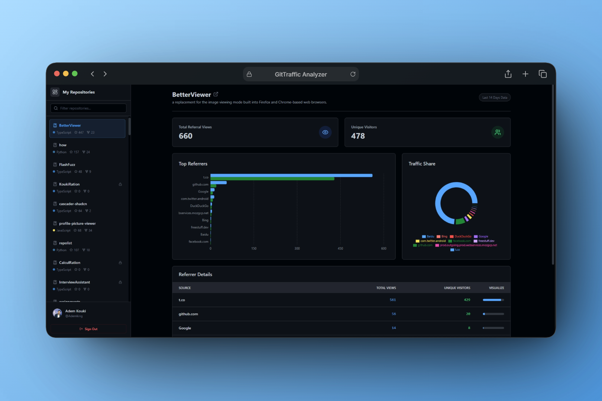

# GitTraffic Analyzer

GitTraffic Analyzer is a tiny app that helps you understand how people find your GitHub repositories. It shows traffic and referrer stats in a clean, easy-to-use dashboard right from your browser.

You can try it here: [https://ademking.github.io/gittraffic-analyzer/](https://ademking.github.io/gittraffic-analyzer/)



## What it does

- Connects to GitHub using a personal access token
- Lists your repositories in one place
- Shows traffic insights like:
  - Where visitors come from (referrers)
  - Visitor and unique view counts
- Uses live data from the GitHub API

## Why I built this

Many developers struggle to understand how their projects are discovered on GitHub. GitTraffic Analyzer simplifies this by providing a clear view of traffic sources and visitor behavior

## Getting started

```
git clone https://github.com/Ademking/gittraffic-analyzer
cd gittraffic-analyzer
npm install
npm run dev
```

## GitHub token

You'll need a GitHub Personal Access Token with:

- repo
- read:user

## Contributing

Feel free to fork, tweak, and improve the project.
